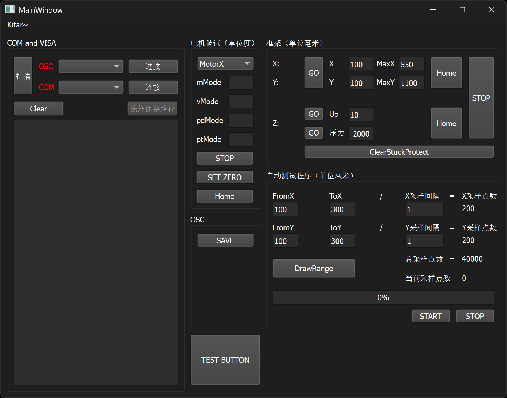

# AwakinoUSTCscan - Awaki的超声波C扫描系统


## 项目简介

AwakinoUSTCscan是一个集成化的超声波C扫描（C-Scan）系统，用于材料无损检测。该系统包含Qt编写的主控制程序和Python后处理脚本，能够实现自动化的三维扫描控制、数据采集、以及波形分析与可视化。



## 模块

### 1. AwakinoUSTCscan（Qt主程序）
- **主控界面**：基于Qt6的图形用户界面
- **硬件控制**：集成步进电机控制和示波器通信
- **扫描控制**：支持XYZ三轴精密定位和自动化扫描
- **数据采集**：示波器波形数据获取和存储

### 2. PythonScripts（后处理工具集）
- **数据可视化**：C扫描图像显示和波形查看器
- **信号处理**：滤波、包络检测、回波拟合
- **机器学习**：CNN模型训练和预测

## 功能

### 底层控制
- ✅ 四轴CAN总线闭环步进电机控制（X、Y0、Y1、Z轴），电机位置轮询
- ✅ 示波器VISA通信协议支持

### 自动C扫描
- ✅ 扫描区域设置
- ✅ 自定义Z轴抬升/下压控制
- ✅ 可调节扫描间隔和速度
- ✅ 紧急停止和堵转保护

### 数据处理
- ✅ 数据格式转换
- ✅ 经验模态分解的tof估计
- ✅ CNN深度学习的tof估计

### 可视化工具
- ✅ 交互式C扫描图像查看器，支持多层切片浏览

## 环境依赖

### Qt主程序编译环境
```
- Qt 6.x
- CMake >= 3.16
- C++17编译器
- Qt6::Widgets
- Qt6::SerialPort
- VISA C++库
```

### Python环境依赖
```bash
pip install -r requirements.txt
```

主要依赖包：
- `matplotlib==3.10.0` - 数据可视化
- `numpy==2.2.1` - 数值计算
- `scipy` - 信号处理
- `torch` - 深度学习

## 使用指南

### 1. 硬件连接
- 步进电机控制器通过CAN-COM连接到上位机，转换设备应使用slcan协议
- 连接示波器接口(USB/网络)
- 扫描设备，确认COM和VISA设备在线

### 2. 扫描设置
- 设置扫描区域（FromX, ToX, FromY, ToY）
- 配置扫描间隔（X_samp_interval, Y_samp_interval）
- 点击DrawRange确认即将扫描的区域

### 3. 开始扫描
- 设置波形文件保存路径（未实装，将保存到"*项目目录/OSCget*"文件夹
- 点击START开始扫描

### 4. 数据分析
- 使用C_ScanViewer查看扫描结果
- 通过滑动条浏览不同深度切片
- 点击图像查看对应位置波形

## 文件结构说明

```
├── AwakinoUSTCscan/          # Qt主程序源码
│   ├── main.cpp             # 程序入口
│   ├── mainwindow.cpp/h     # 主窗口界面
│   ├── ustcscanmonitor.cpp/h # 扫描监控核心
│   ├── motor.cpp/h          # 电机控制
│   ├── osc.cpp/h           # 示波器控制
│   ├── com.cpp/h           # 串口通信
│   └── visa/               # VISA库文件
├── PythonScripts/           # Python后处理工具
│   ├── C_ScanViewer.py     # C扫描可视化工具
│   ├── visaget.py          # 示波器数据采集
│   ├── EchoModel.py        # 回波信号建模
│   ├── utility.py          # 通用工具函数
│   └── 手动拟合工具_tk.py    # 手动拟合界面
├── NpWaveData/             # numpy波形数据存储
├── OSCget/                 # 示波器原始数据
├── config.ini              # 系统配置文件
├── pyproject.toml          # Python项目配置
└── requirements.txt        # Python依赖列表
```
